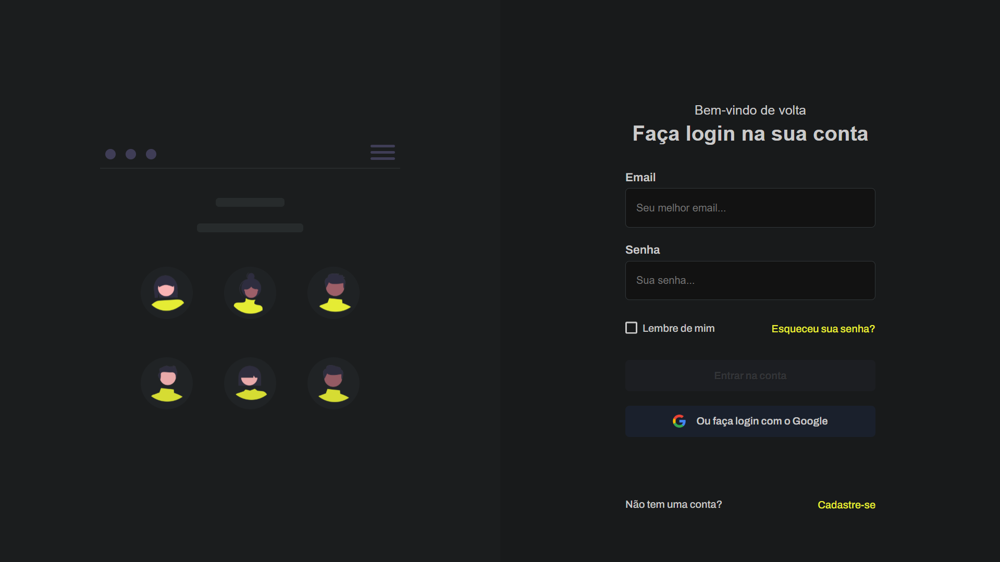

# Login Page

> Status : Finished project ✅ / Open PR

## Chanllenge 🎯

_Technologies_

+ Html5 
+ Javascript 
+ Css3 

### How to use

- git clone https://github.com/12Gustavo21/login-page.git or download the zip
- unzip if you download the zip
- code . (if you use VSCode)
- start a live server

## 💻 Online Page: https://12gustavo21.github.io/login-page